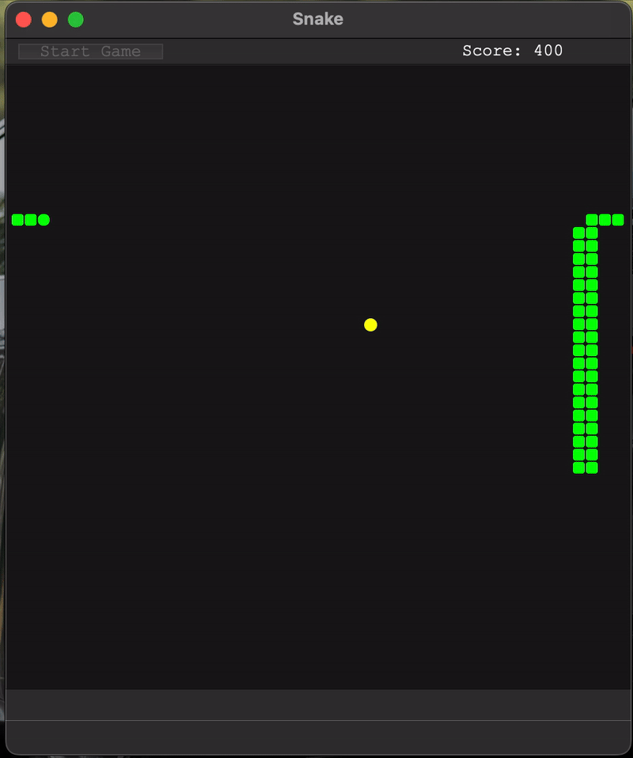

# 🐍 SnakeGame

A classic **Snake game** implemented in **C++ using the Qt framework**.  
Cleanly structured, responsive, and designed with maintainability in mind — this project is both fun to play and a solid demonstration of modern C++ and Qt development practices.



---

## 📌 Table of Contents

- 📖 About  
- 🚀 Features  
- 🧠 Architecture & Design  
- 🛠️ Technologies Used  
- 🎮 Gameplay & Controls  
- 💻 Getting Started  
  - 🧾 Prerequisites  
  - 📥 Build & Installation  
  - ▶️ Running the Game  
- 📂 Project Structure  
- 🧪 Testing  
- 💡 Customization Ideas  
- 🤝 Contributing  
- ⚠️ License  
- 📬 Acknowledgements  

---

## 📖 About

**SnakeGame** is a desktop implementation of the timeless Snake arcade game, written in **C++ with Qt**.  
The objective is simple: control the snake, eat food to grow longer, and avoid collisions with your own body.

Beyond gameplay, the project serves as a clean example of:

- Event-driven programming with Qt  
- Object-oriented design in C++  
- Real-time game logic using timers  

---

## 🚀 Features

- Classic Snake gameplay  
- Smooth, timer-based movement  
- Collision detection  
- Snake growth mechanics  
- Score tracking  
- Sound effects for gameplay feedback  
- Modular, readable code structure  

---

## 🧠 Architecture & Design

The game is structured to keep logic, rendering, and input handling clearly separated.

Key design aspects include:

- Qt timers for the game loop and movement updates  
- Signals & slots for input handling and state changes  
- Encapsulated game objects (snake, board, food, etc.)  
- Extensible structure, making it easy to add new features or tweak gameplay behavior  

---

## 🛠️ Technologies Used

- C++ (C++17 or newer)
- Qt 6
- Qt Widgets
- CMake

---

## 🎮 Gameplay & Controls

### 🎯 Objective

Eat food to grow longer and increase your score, while avoiding:

- The game boundaries  
- The snake’s own body  

The game ends upon collision.

### 🎮 Controls

| Action      | Key      |
|------------|----------|
| Move Up    | ↑ / W    |
| Move Down  | ↓ / S    |
| Move Left  | ← / A    |
| Move Right | → / D    |

---

## 💻 Getting Started

### 🧾 Prerequisites

Make sure the following are installed:

- Qt (version 6)
- A C++17-compatible compiler (GCC / Clang / MSVC)
- CMake 3.16 or newer

---

### 📥 Build & Installation

1. Clone the repository:
   ```bash
   git clone https://github.com/tameraktekin/snakeGame.git
   cd snakeGame
   ```

2. Create and enter a build directory:
   ```bash
   mkdir build
   cd build
   ```

3. Configure the project with CMake:
   ```bash
   cmake ..
   ```

4. Build the project:
   ```bash
   cmake --build .
   ```

---

### ▶️ Running the Game

From inside the `build` directory:

```bash
./SnakeGame
```

On Windows:

```bash
SnakeGame.exe
```

---

## 📂 Project Structure

```
snakeGame/
├── assets/               # Sound effects
├── include/              # Header files
│   ├── Snake.h
│   ├── Board.h
│   └── ...
├── src/                  # Source files
│   ├── main.cpp
│   ├── Snake.cpp
│   └── ...
├── tests/                # Unit test sources
├── CMakeLists.txt        # Build configuration
├── README.md             # Project documentation
└── .gitignore
```

---

## 🧪 Testing

The project includes unit tests that are automatically built by CMake.

After building the project, run the test executable from the `build` directory:

```bash
./snakeTests
```

On Windows:

```bash
snakeTests.exe
```

No additional setup or configuration is required.

---

## 💡 Customization Ideas

- Increasing difficulty over time  
- High-score persistence (file-based or database)  
- Visual themes or grid customization  
- Pause / resume functionality  
- Sound toggle or volume control  
- Mobile or touch support  

---

## 🤝 Contributing

Contributions are welcome.

If you’d like to improve the project:

1. Fork the repository  
2. Create a feature branch  
3. Commit your changes with clear messages  
4. Open a pull request  

---

## ⚠️ License

This project does **not** include a license.

All rights are reserved by the author unless explicitly stated otherwise.

---

## 📬 Acknowledgements

Created by **tameraktekin**.  
Inspired by classic arcade games and built as a practical exploration of C++ and Qt development.

---

Enjoy the game! 🐍
